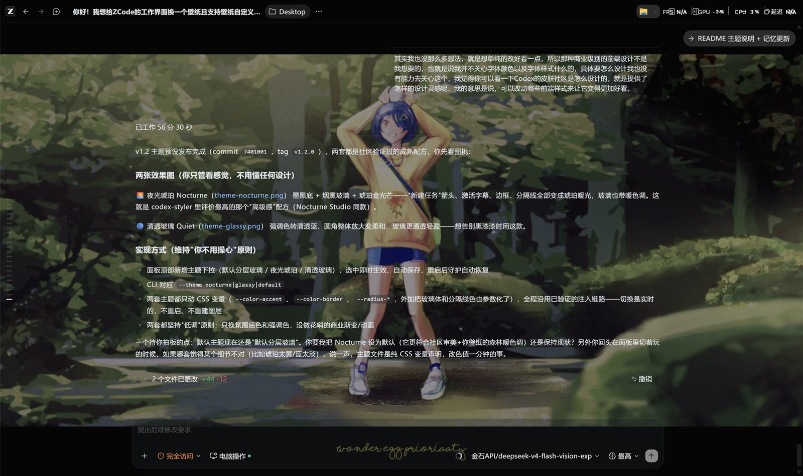
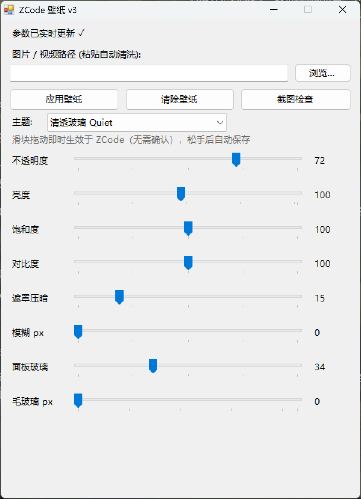

<p align="center">
  <b>ZCode Wallpaper</b><br>
  <i>One ~150&nbsp;KB single-file EXE that wears ZCode's desktop bed in live wallpapers — images, animated GIFs, even video — plus rotation, glass dialogs and a music layer, without touching a single ZCode file.</i>
</p>

<p align="center">
  
  
  
  
  
</p>

<p align="center">
  
</p>

---

## ✨ Features

- **🖼 Live wallpapers** — PNG / JPG / WebP, animated GIF, and full-screen video (MP4 / WebM, looping continuously; soundtrack state is controlled separately).
- **🔄 Wallpaper rotation** — point it at a folder and it cycles your collection with a smooth cross-fade (images only; music keeps playing through the switch — the fade happens inside the layer, no re-injection). Sequential or random, interval from 1 to 60 minutes.
- **🎵 One explicit sound source** — choose silence, the video wallpaper's soundtrack, or an independent music file (MP3/WAV/OGG/M4A/FLAC). The panel always names what its button controls, keeps one shared volume, and can pause sound only when less than 10% of ZCode remains visible; split-screen use keeps playing even when another app has focus.
- **🗂 Three-panel GUI** — the control panel is split into tabs: **Files** (wallpaper path, rotation folder, music file), **Playback** (sound source, source-specific play/pause, volume, follow-window toggle, rotation cadence) and **Style** (theme, 8 sliders, color pickers).
- **🎛 8 real-time sliders** — opacity, brightness, saturation, contrast, overlay, blur, panel-glass opacity, panel-glass blur. Dragging a slider changes ZCode instantly — what you tweak is what you see, zero "Apply" round-trips.
- **🥃 Layered glass UI** — the wallpaper is the star, and the workspace sidebar + composer float above it as translucent frosted-glass panels with subtle separators. No flat "everything transparent" look. Full-screen route overlays (like the upgrade page) and modal dialogs get the same glass treatment, so nothing melts into the wallpaper.
- **🎨 Theme presets & color pickers** — one-click moods built on the Codex skin community's playbook: **Nocturne** (`ink-black + smoked glass + amber glow`) and **Quiet Glass** (low-contrast translucent panels, softer radii). Two color pickers (accent + glass tint) override the palette live; a `custom.css` escape hatch gives power users the last word on any style.
- **🛡 Update-proof** — injection happens through the Chrome DevTools Protocol. ZCode's `app.asar` is never modified, so app updates cannot break it.
- **🌙 Silent daemon** — re-applies the wallpaper after ZCode restarts or opens new windows; registered for auto-start, zero windows, zero clicks.
- **📦 One file, zero dependencies** — ~150 KB compiled C# 5 (runs on the .NET Framework that ships with Windows), no Node, no runtime, no scripts, no admin rights.
- **🗑 Restore in two clicks** — tray menu → "Uninstall & restore" puts the stock ZCode back and cleans up every shortcut and autostart entry.

## 📸 Gallery

<p align="center">
  
</p>

## 🚀 Getting started

1. **Grab the binary** — `app/ZCodeWallpaper.exe` (in the release zip), no installation needed.
2. **One-time setup** (also re-run after ZCode updates):

```bash
ZCodeWallpaper.exe setup
```

   This adds `--remote-debugging-port=9335` to your existing ZCode shortcuts (backups kept as `*.zcwp.bak`), creates the silent autostart entry, and puts a **「换壁纸」** desktop shortcut in place.

3. **Start it** — double-click the desktop shortcut. Browse to an image (or paste a path — quotes, spaces and `/d/…` Unix-style paths are cleaned automatically), hit **Apply**, done. The daemon keeps it alive from then on with zero attention.

## 💻 Command line

```
ZCodeWallpaper.exe apply <path> [--opacity 55] [--brightness 100] [--saturation 100]
                                   [--contrast 100] [--overlay 30] [--blur 0]
                                   [--panel-opacity 55] [--panel-blur 10] [--theme nocturne|glassy|default]
                                   [--video-sound on|off] [--music-follow on|off] [--accent "R,G,B|#RRGGBB|default"] [--glass "R,G,B|#RRGGBB|default"]
ZCodeWallpaper.exe music <path> [--volume 60]   # select & enable a music file (independent layer)
ZCodeWallpaper.exe music-off                    # stop and clear music
ZCodeWallpaper.exe rotate <folder> [--minutes 15] [--order seq|random]
                                   # cycle every image in a folder, cross-faded
ZCodeWallpaper.exe rotate-off                   # stop rotation (keep current wallpaper)
ZCodeWallpaper.exe clear            # remove the wallpaper layer, keep config
ZCodeWallpaper.exe status           # CDP / window / wallpaper / rotation status
ZCodeWallpaper.exe shot <out.png>   # screenshot of the ZCode window
ZCodeWallpaper.exe setup            # shortcuts flag + autostart + desktop entry
ZCodeWallpaper.exe uninstall        # full restore to stock ZCode
```

CLI output is also mirrored to `app/data/cli-out.log` (stdout can get lost in some hosts).

## 🔍 How it works — and how it finds ZCode

No application scanning, no installation detection. The discovery is just **one agreed local port**:

1. `setup` adds `--remote-debugging-port=9335` to ZCode's launch shortcuts, so every ZCode window starts with a Chrome DevTools Protocol endpoint on `127.0.0.1:9335`.
2. The tool polls `http://127.0.0.1:9335/json` every 3 seconds and reads the window list directly from the protocol — that's how it "recognizes" ZCode (any Chromium page target on that port, nothing else).
3. For each ZCode window it injects via `Runtime.evaluate`: background CSS variables (`--color-background-win-alt`, …) are set transparent through `document.adoptedStyleSheets` (immune to CSP), and two fixed full-viewport layers — wallpaper + black overlay — are placed behind the UI (`z-index:-1`, `pointer-events:none`).
4. Layers of taste on top: the sidebar and composer become smoked-glass panels (`backdrop-filter` blur) driven by live `--zcwp-panel-*` properties; themes flip a `data-zcwp-theme` attribute that swaps accent/glass/radius variables.
5. If a window loses its `window.__ZCWP.on` marker (restart, new window, reload), the daemon re-injects within seconds and re-verifies every 15 seconds.
6. A lightweight Windows visibility check runs every 500 ms. It clips ZCode's client area to the desktop and subtracts higher windows; CDP is contacted only when the resulting 10% visibility gate changes.

The port is loopback-only, so nothing outside your machine can reach it.

## 🎨 Customization

`app/wallpaper.css` is the entire injected style template — themes, glass panels, dialog/overlay glass, and the transparency list all live there as plain CSS custom properties. If a future ZCode update introduces new background variables, add them to this one file — **no recompile needed**.

For everything more personal — button styles, radii, fonts, any selector — drop an `app/custom.css` next to it. It is appended after the built-in styles on every injection, so it always wins.

## 🔨 Build

```bash
csc -nologo -target:winexe -out:ZCodeWallpaper.exe ZCodeWallpaper.cs \
    -r:System.dll -r:System.Core.dll -r:System.Drawing.dll -r:System.Windows.Forms.dll -r:Microsoft.CSharp.dll
```

## 📄 License

[MIT](LICENSE) © 2026 Amazinnn
