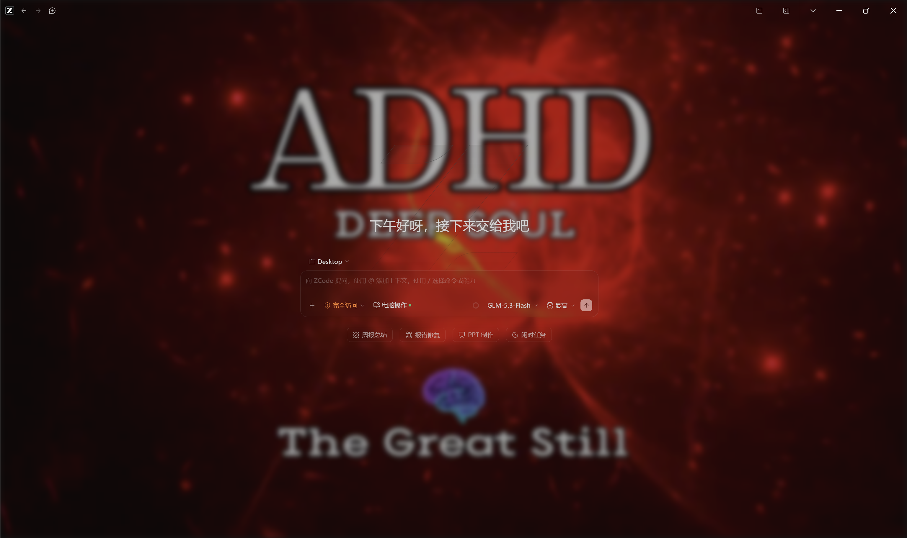
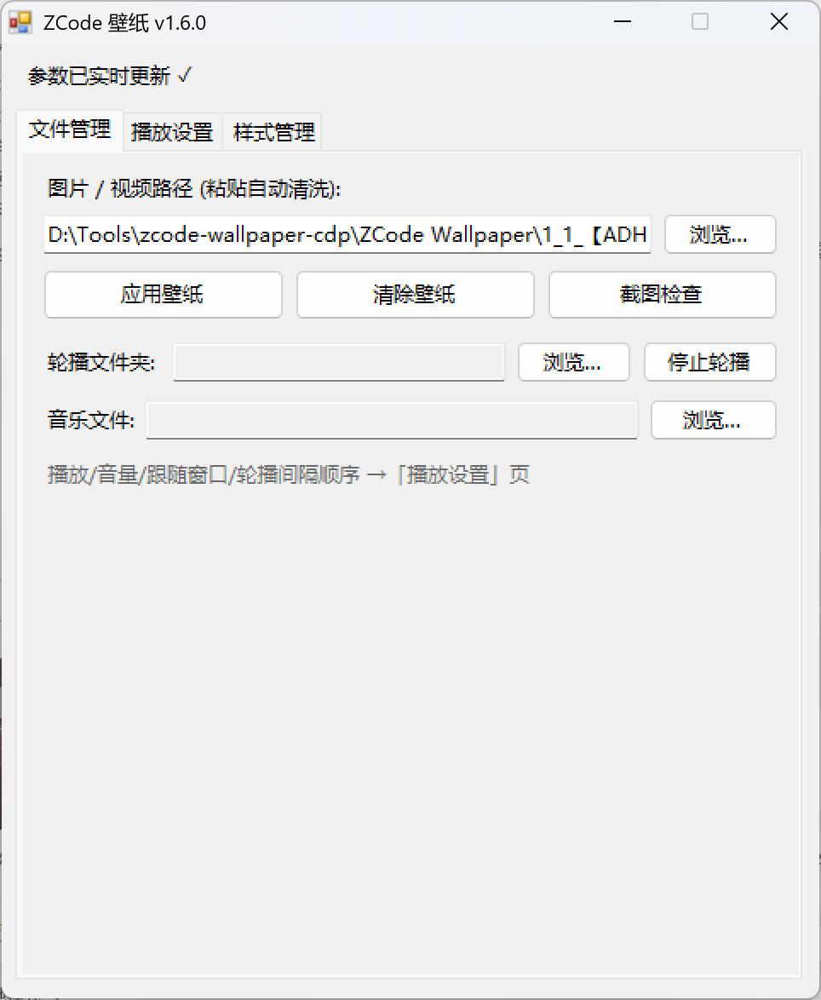
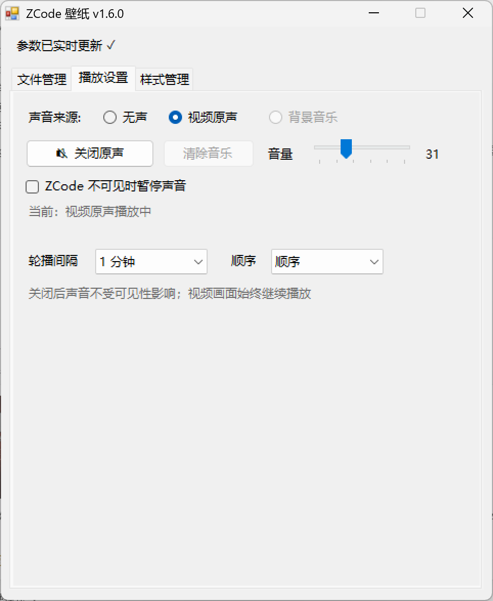
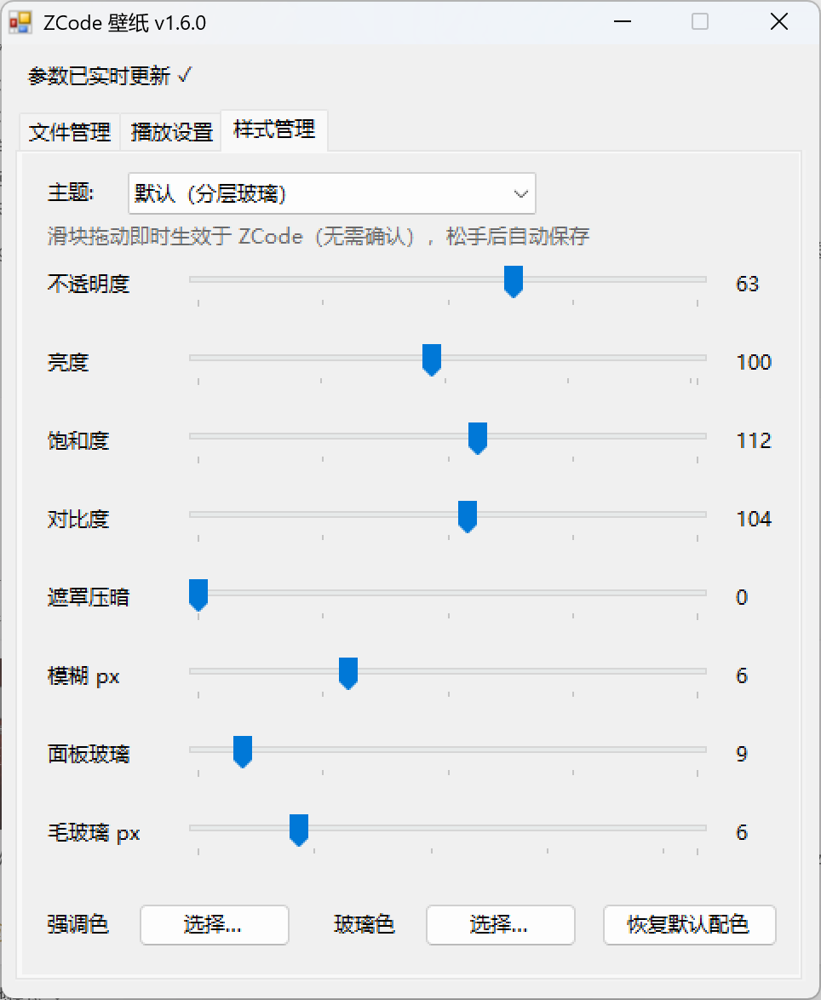

<div align="center">

# ZCode Wallpaper

**Give ZCode a living desktop: images, GIFs, video, glass effects, and sound — without modifying ZCode itself.**

[](https://github.com/Amazinnn/ZCode-Wallpaper/releases/latest)


[](LICENSE)



</div>

## Why ZCode Wallpaper?

ZCode Wallpaper is a small, dependency-free Windows companion for the ZCode desktop app. It adds a wallpaper layer through the Chrome DevTools Protocol, so it never patches `app.asar` or replaces ZCode files.

- Images, animated GIF/WebP, and looping MP4/WebM video
- Smooth image rotation with sequential or random order
- Layered glass themes with live visual controls
- One explicit sound source: silence, video soundtrack, or background music
- A silent daemon that restores the wallpaper after ZCode reloads or opens a new window
- One ~175 KB C# executable; no installer, runtime download, admin access, or Node.js required

## What's new in v1.6.0

### Sound controls that say exactly what they control

Video sound and background music now share one clear model. Select **Silence**, **Video soundtrack**, or **Background music**, then use a source-specific play/pause button and one shared volume control. Only one source can be audible at a time.

### Follow what is visible, not what has focus

The optional visibility gate now pauses sound only when less than 10% of ZCode is actually visible. Split-screen work and partially covered windows keep playing even when another app has keyboard focus. Minimizing ZCode, fully covering it, switching virtual desktops, or locking Windows pauses sound; restoring visibility resumes it unless the user paused it manually.

Video imagery always continues playing. The visibility gate affects sound only.

## Control panel

<table>
  <tr>
    <td width="33%" align="center"></td>
    <td width="33%" align="center"></td>
    <td width="33%" align="center"></td>
  </tr>
  <tr>
    <td align="center"><b>Files</b><br><sub>Wallpaper, rotation folder, and music</sub></td>
    <td align="center"><b>Playback</b><br><sub>Sound source, volume, visibility, and rotation</sub></td>
    <td align="center"><b>Style</b><br><sub>Theme, image tuning, glass, and colors</sub></td>
  </tr>
</table>

Every slider updates ZCode immediately. File paths and settings are saved automatically.

## Install

1. Download the latest package from [GitHub Releases](https://github.com/Amazinnn/ZCode-Wallpaper/releases/latest) and extract it anywhere.
2. Open a terminal in the extracted folder and run the one-time setup:

   ```powershell
   .\ZCodeWallpaper.exe setup
   ```

3. Restart ZCode, then open the generated **换壁纸** desktop shortcut.
4. Choose an image or video and select **应用壁纸**.

Setup adds `--remote-debugging-port=9335` to existing ZCode shortcuts, keeps `*.zcwp.bak` backups, registers the silent daemon for startup, and creates the wallpaper control shortcut. Re-run setup if a ZCode update replaces its shortcuts.

To remove everything and restore the original shortcuts:

```powershell
.\ZCodeWallpaper.exe uninstall
```

## Supported media

| Layer | Formats | Notes |
| --- | --- | --- |
| Wallpaper | PNG, JPG/JPEG, WebP, GIF | Static or animated |
| Video wallpaper | MP4, WebM | Loops continuously; soundtrack is controlled separately |
| Background music | MP3, WAV, OGG, M4A, FLAC | Independent from the wallpaper |
| Rotation | Image formats above | Sequential or random, every 1–60 minutes |

## Command line

<details>
<summary>Show all commands</summary>

```text
ZCodeWallpaper.exe apply <path> [--opacity 55] [--brightness 100] [--saturation 100]
                                   [--contrast 100] [--overlay 30] [--blur 0]
                                   [--panel-opacity 55] [--panel-blur 10]
                                   [--theme nocturne|glassy|default]
                                   [--video-sound on|off] [--music-follow on|off]
                                   [--accent "R,G,B|#RRGGBB|default"]
                                   [--glass "R,G,B|#RRGGBB|default"]
ZCodeWallpaper.exe music <path> [--volume 60]
ZCodeWallpaper.exe music-off
ZCodeWallpaper.exe rotate <folder> [--minutes 15] [--order seq|random]
ZCodeWallpaper.exe rotate-off
ZCodeWallpaper.exe clear
ZCodeWallpaper.exe status
ZCodeWallpaper.exe shot <out.png>
ZCodeWallpaper.exe setup
ZCodeWallpaper.exe uninstall
```

`--music-follow` keeps its historical name for CLI compatibility; in v1.6.0 it controls the visibility gate for both video sound and background music. CLI output is mirrored to `app/data/cli-out.log`.

</details>

## How it works

1. Setup starts ZCode with a loopback-only Chrome DevTools Protocol endpoint on `127.0.0.1:9335`.
2. The daemon discovers ZCode page targets through that endpoint and injects the wallpaper and glass layers with `Runtime.evaluate`.
3. A lightweight check restores the layer after reloads and new windows.
4. Every 500 ms, Windows APIs measure how much of the ZCode client area remains visible. CDP is contacted only when the 10% visibility decision changes.

The injected layers use `pointer-events:none` and remain behind the interface. No ZCode application files are modified.

## Customize

`app/wallpaper.css` contains the built-in theme and glass rules. Put a `custom.css` file beside the executable to append your own selectors after the defaults; no recompile is needed.

## Build from source

From `app/`, use the C# compiler included with .NET Framework:

```powershell
csc -nologo -target:winexe -out:ZCodeWallpaper.exe ZCodeWallpaper.cs `
    -r:System.dll -r:System.Core.dll -r:System.Drawing.dll `
    -r:System.Windows.Forms.dll -r:Microsoft.CSharp.dll
```

## License

[MIT](LICENSE) © 2026 Amazinnn
