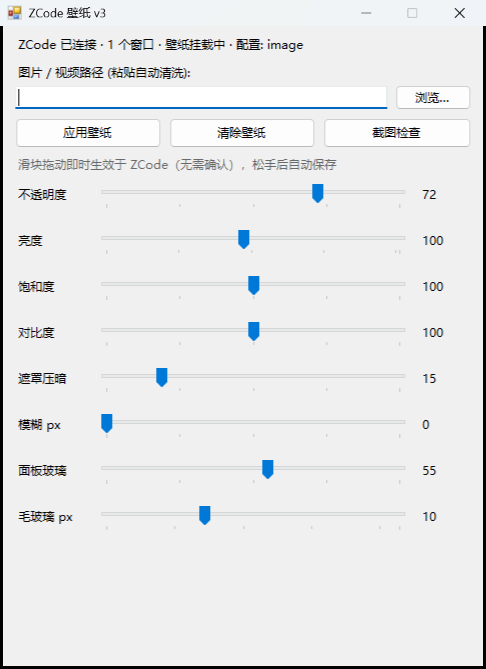

# ZCode Wallpaper

**A single-file C# wallpaper/theme injector for the ZCode desktop app (Electron).**
Inject live wallpapers — images, animated GIF/WebP, even full-screen video — into the ZCode
work window in real time, without touching a single ZCode file. Survives app updates.


## What it does

- **One EXE, zero dependencies.** ~98 KB of compiled C# 5 (no node, no runtime installs, no scripts).
- **Real-time tuning.** Brightness / saturation / contrast / opacity / overlay / blur sliders —
  what you drag is what you see, instantly, inside ZCode.
- **Layered glass UI.** The wallpaper is the star; the sidebar and composer float above it as
  translucent frosted-glass panels (blur + subtle separator), with their own opacity/blur sliders —
  nothing is one flat transparent window.
- **Media wallpapers.** PNG / JPG / WebP / animated GIF, and video (MP4 / WebM, muted & looping,
  auto-pauses when ZCode loses focus to save CPU).
- **Survives everything.** Injection works through the Chrome DevTools Protocol (CDP) — ZCode's
  `app.asar` is never modified, so app updates can't break it.
- **Silent daemon.** Re-applies the wallpaper automatically after ZCode restarts or spawns new windows.



## Requirements

- Windows 10/11 (ships .NET Framework 4.8)
- ZCode desktop app

## Quick start

The EXE is shipped at `app/ZCodeWallpaper.exe`. Double-click it to open the control panel
(if the daemon is already running, it will just bring the panel up). Everything is built in:

| Want to... | Do... |
|---|---|
| Set a wallpaper | Panel → browse or paste a path (quotes, spaces and `/d/...` Unix-style paths are cleaned automatically) → **Apply** |
| Tune live | Drag the sliders — changes apply to ZCode instantly and auto-save |
| Video / animation | Pick an MP4/WebM/GIF/WebP in the same dialog |
| Keep it after restarts | Nothing — the silent daemon is registered for auto-start (`setup`) |
| Re-configure after a ZCode update | `ZCodeWallpaper.exe setup` |
| Restore the official look | Tray menu → **Uninstall & restore** (also `ZCodeWallpaper.exe uninstall`) |

### Command line

```
ZCodeWallpaper.exe apply <path> [--opacity 55] [--brightness 100] [--saturation 100] [--contrast 100] [--overlay 30] [--blur 0] [--panel-opacity 55] [--panel-blur 10]
ZCodeWallpaper.exe clear            # remove wallpaper layer, keep config
ZCodeWallpaper.exe status           # CDP / window / wallpaper status
ZCodeWallpaper.exe shot <out.png>   # screenshot of the ZCode window
ZCodeWallpaper.exe setup            # add debug-port flag to ZCode shortcuts, register daemon+desktop entry
ZCodeWallpaper.exe uninstall        # full restore: clear wallpaper, restore shortcuts, remove autostart
```

CLI output is mirrored to `app/data/cli-out.log` (stdout may be lost in some hosts).

## How it works

1. ZCode is launched with `--remote-debugging-port=9335` (added to its shortcuts by `setup`).
2. The tool connects to the window via CDP and injects JS: background CSS variables
   (`--color-background-win-alt`, …) are made transparent via `document.adoptedStyleSheets`
   (immune to CSP), and two fixed full-viewport layers are added — the wallpaper layer and a
   black overlay — behind the UI (`z-index:-1`, `pointer-events:none`).
3. A layered-glass scene is layered on top: the workspace sidebar and the composer card get
   translucent dark backgrounds with `backdrop-filter` blur, driven by the
   `--zcwp-panel-opacity` / `--zcwp-panel-blur` custom properties (updated live by the sliders).
4. Images are inlined as data URLs; videos use `file://` (a local TCP server is the fallback).
5. The daemon polls `/json` every 3 s and re-injects into any ZCode window that lost the
   `window.__ZCWP.on` marker (restarts, new windows), verifying every 15 s.

`app/wallpaper.css` is the external style template. If a future ZCode update changes its
background variable names, update that single file — no recompile needed.

## Build from source

```
csc -nologo -target:winexe -out:ZCodeWallpaper.exe ZCodeWallpaper.cs
    -r:System.dll -r:System.Core.dll -r:System.Drawing.dll -r:System.Windows.Forms.dll -r:Microsoft.CSharp.dll
```

## License

[MIT](LICENSE)
